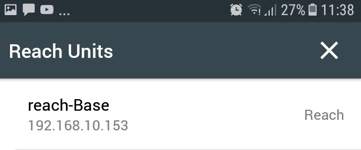

### Reach Base

- EMLID REACH https://docs.emlid.com/reach/
- Raspberry Pi
 

### Reach View Apps 
https://play.google.com/store/apps/details?id=com.reachview&hl=sv

**Connecto to wifi and run Base Reach**

  
  

**Status**

  

**RTK settings**

  
  

**Correction Input, Position output**

  
  

**Base Mode**

  
  

